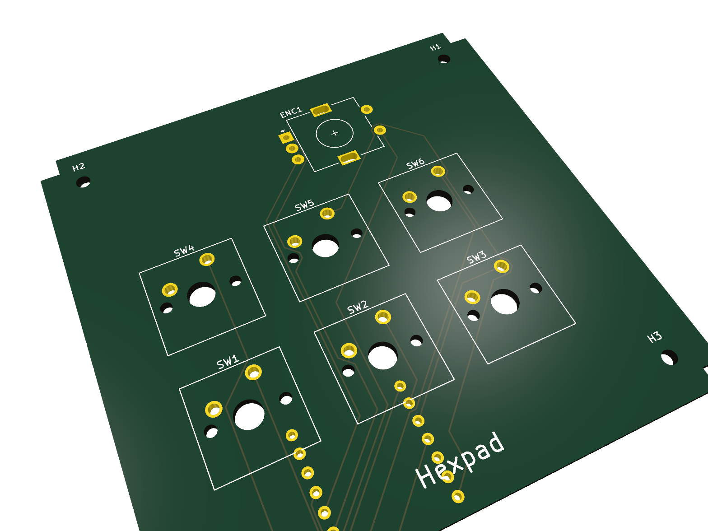
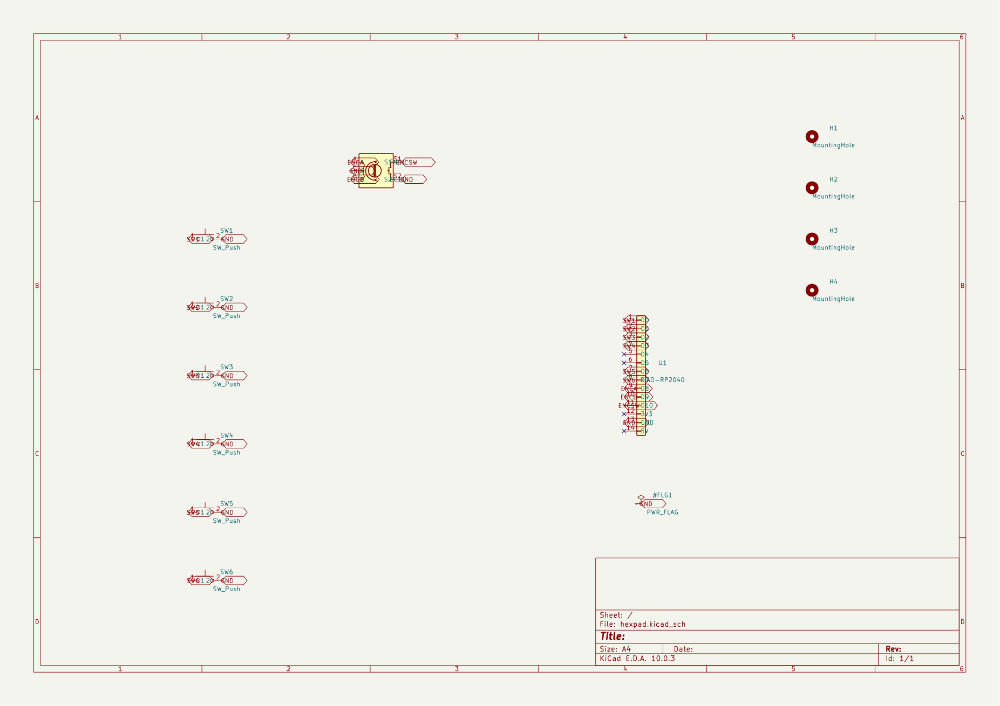
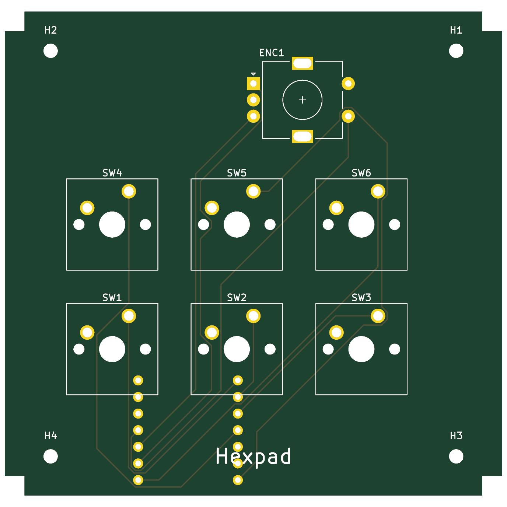
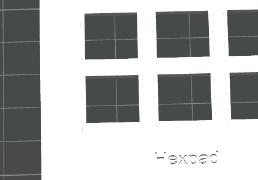

# Hexpad — a hex-shaped 6-key macropad

A 6-key (3×2) macropad with a rotary encoder: 3D-printed case, custom 2-layer PCB,
and KMK firmware, driven by a **Seeed XIAO RP2040**. Keys wire **direct to GPIO**
(no matrix, no diodes), and the encoder handles volume/scroll.

<!-- HACKPAD: a full render showing ALL parts is required. Export one from the
     KiCad 3D viewer or your CAD tool and drop it at the path below. -->

## Inspiration & challenges

I wanted a compact editing/clipboard pad with a volume knob that didn't look like
every other square macropad — so Hexpad uses a hexagonal silhouette around a
centered 3×2 key cluster with the encoder up top.

Two things were genuinely fiddly. First, the original top-plate CAD came out of an
early IDE session malformed — the plate solid was fused to a stray slab 74 mm
below it, so it "levitated" in the slicer. I had to reverse-engineer the real
dimensions from the STEP geometry and rebuild the plate as a clean parametric
build123d script. Second, rather than hand-draw the board I generated the PCB
programmatically with KiCad's `pcbnew` API from a single coordinate spec, which
guarantees the switch, encoder, and mounting-hole positions line up exactly with
the printed plate (19.05 mm pitch, mounts at ±31 mm).

## Gallery

| Schematic | PCB | Case |
|-----------|-----|------|
|  |  |  |

<!-- HACKPAD requires a photo of each: the schematic, the PCB (KiCad render or the
     real board), and the case. Add the three images to docs/images/. -->

## Bill of materials

Full sheet: [`docs/electronics/hexpad-bom.csv`](docs/electronics/hexpad-bom.csv).

| Qty | Part | Notes |
|-----|------|-------|
| 1 | Seeed XIAO RP2040 | MCU, mounted on the back; USB-C exits the front edge |
| 6 | Cherry MX (or compatible) switch | `MX_Only_1.00u`, direct-wired, one GPIO each |
| 1 | Alps EC11 rotary encoder w/ switch | A/B + push → 3 GPIO, common → GND |
| 4 | M2 screw (~6 mm) | through the case into the plate's corner posts |
| 6 / 1 | MX keycaps / encoder knob | cosmetic |
| 0 | diodes | **none** — direct wiring is valid for ≤7 keys |

## Project layout

| Folder | Contents |
|--------|----------|
| `cad/` | Enclosure: STEP blueprints + parametric build123d source |
| `pcb/` | KiCad 10 PCB project, schematic, + fabrication Gerbers |
| `firmware/` | KMK (CircuitPython) keymap |
| `docs/electronics/` | Schematic (SVG), BOM, PCB design notes |
| `docs/images/` | Render + schematic/PCB/case photos for this README |

## PCB

| File | Purpose |
|------|---------|
| `pcb/hexpad.kicad_sch` | Schematic (XIAO + 6 switches + encoder) |
| `pcb/hexpad.kicad_pcb` | KiCad 10 board, branded, routed |
| `pcb/hexpad-gerbers.zip` | **Upload to JLCPCB** to order boards |
| `pcb/build_hexpad_pcb.py` / `build_hexpad_sch.py` | Regenerate board/schematic from the spec |

2-layer, **76 × 74 mm** (within the 100 mm limit), silkscreen-branded "Hexpad",
matching the plate's switch / encoder / mounting coordinates.

## Firmware

KMK keymap at `firmware/code.py`. Default: front row Copy/Paste/Cut, rear row
Undo/Redo/Save, encoder = volume (press = mute). See `firmware/README.md` for
flashing and remapping.

## Pin map

| Input | XIAO pin | | Input | XIAO pin |
|-------|----------|-|-------|----------|
| SW1–SW3 (front) | D0, D1, D2 | | Encoder A / B | D8 / D9 |
| SW4–SW6 (rear) | D3, D6, D7 | | Encoder push | D10 |

`D4`/`D5` (SDA/SCL) left free for a future OLED. All inputs use the RP2040's
internal pull-ups.

## Toolchain

build123d (CAD → STEP) · KiCad 10 (PCB) · Bambu Studio (slicing) · CircuitPython + KMK.

## Submission checklist (Hackpad)

- [x] DRC: 0 errors, 0 unconnected (only silk + courtyard warnings) — re-plotted after branding
- [x] "Hexpad" on the PCB silkscreen
- [x] "Hexpad" engraved on the top plate (front margin, 0.6 mm deep) — **reprint the plate to get it physically**
- [ ] 3D-printed parts need no supports / tolerances ~0.25 mm *(verify on your physical print)*
- [x] PCB < 100 × 100 mm; ≤16 switches, ≤2 encoders, ≤1 OLED, ≤16 LEDs
- [x] README photos: render + PCB + schematic + case (`docs/images/`)

## Build checklist

- [x] CAD: top plate + bottom case
- [x] PCB: schematic + routed board + Gerbers
- [x] Firmware keymap
- [x] Re-plot Gerbers after the silkscreen branding change
- [ ] Order PCB from JLCPCB · print case · solder · flash · assemble
